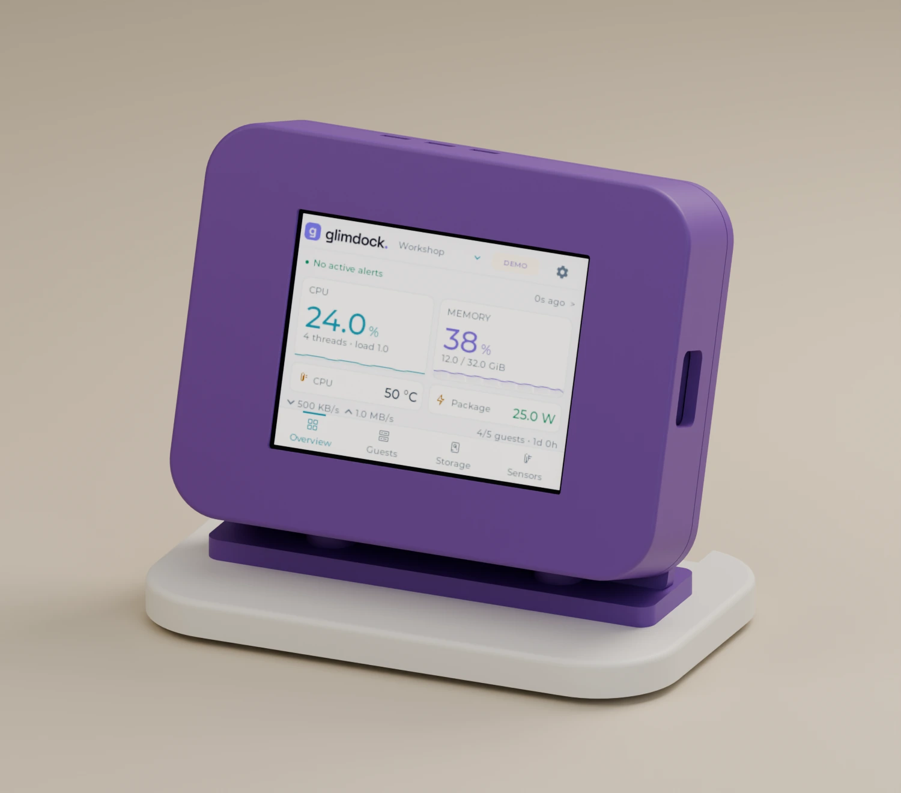
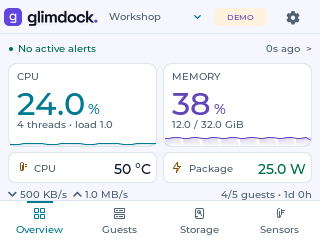
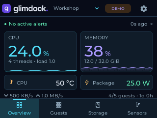
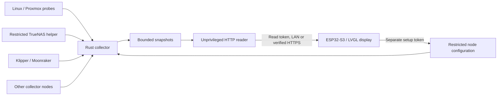

# Glimdock — ESP32-S3 homelab monitor

**Your Proxmox hosts, Linux sensors and Klipper printers, at a glance on your desk.**

[Website](https://glimdock.com) · [Download v0.1.0](https://github.com/gkostadinov/glimdock/releases/tag/v0.1.0) · [Setup guide](SETUP.md) · [Documentation](docs/README.md) · [Contribute](CONTRIBUTING.md)

Glimdock is an open-source touchscreen dashboard for the machines that keep your
home running. It pairs native ESP32-S3 firmware with a Rust collector on your LAN.
See host load, real guest OS memory, storage health, temperatures, GPU telemetry
and print progress without leaving another monitoring page open.

| On the display | What you can inspect |
| --- | --- |
| **Overview** | CPU, RAM, host activity, temperature, power and alerts |
| **Guests** | Proxmox VMs/containers; supported guest OS RAM through QEMU Guest Agent |
| **Storage** | Pools, disk usage, SMART health, temperature and disk I/O |
| **Sensors & GPUs** | Detailed sensors, clocks/C-states, integrated and discrete GPUs |
| **Printers** | Klipper/Moonraker job progress, nozzle/bed temperatures and status |
| **Settings** | Wi-Fi, brightness, white/dark themes and up to four monitor nodes |

Tap for details and swipe to scroll. Choose a node in the header. Missing or stale
sources stay visibly unavailable or dated; Glimdock does not estimate absent
measurements or turn a heater's duty percentage into measured watts.

No cloud telemetry service, paid monitoring subscription or Proxmox login on the
display is required. The collector samples host tools locally and publishes
bounded snapshots. A separate unprivileged HTTP process serves the display using
dedicated read and setup tokens. Klipper integrations are read-only monitoring.

The Linux collector is written in Rust. It samples privileged host tools locally,
publishes bounded snapshots, and serves them through a separate unprivileged HTTP
process. The display holds dedicated read and setup tokens, not a Proxmox login.
Printer integrations query Moonraker; they provide monitoring, not print controls.

**This is a developer alpha for Waveshare ESP32-S3-Touch-LCD-2.8 V1**
(ST7789 + CST328, 16 MiB flash, 8 MiB PSRAM). V2 uses a different touch controller
and is not supported by this release. The enclosure is a prototype pending
physical fit verification. It is not a ready-to-sell certified hardware product.

## Start here

1. Download the matching [Linux archive](https://github.com/gkostadinov/glimdock/releases/tag/v0.1.0), verify its checksum and install the three services using [SETUP.md](SETUP.md).
2. Build and flash the credential-free V1 firmware with PlatformIO.
3. Open Settings → Wi-Fi on the screen, or join **Glimdock-Setup** using the
   randomly generated password shown on the display. Open `http://192.168.4.1/`.
4. Enter your Wi-Fi, collector snapshot URL and separate display/setup tokens.
   Add a printer or another collector in Settings → Nodes.

Linux archives support `x86_64` and `aarch64` and use musl with Rustls TLS.
`x86_64` is tested on Proxmox; ARM64 is compiled and static-ELF verified, with
physical execution still to be verified. See `SHA256SUMS` alongside the downloads.
They do not need a local Python collector.
The optional restricted TrueNAS helper runs Python on the NAS, and Proxmox QGA
requests use its installed Perl libraries. Host probe programs are optional and
documented in the setup guide.

## See the actual interface

| Light theme | Dark theme |
| --- | --- |
|  |  |

These are rendered from the firmware's LVGL interface using authored demo data.
The product image is a CAD visualization, not a photograph of a manufactured unit.
See [image provenance](docs/images/README.md).

## Architecture

Proxmox collection runs on the host. TrueNAS passthrough disks are read from their
owning NAS, not inferred from the hypervisor. Each slow source has its own sampling
and expiry policy. See [architecture and security](docs/ARCHITECTURE.md).

## Source and development

| Path | Purpose |
| --- | --- |
| `collector-rs/` | Rust collector, HTTP reader and configuration service |
| `firmware/` | Native LVGL 9.3 touchscreen firmware |
| `deploy/` | Reviewed installers and service units |
| `branding/` | Original SVG mark and logotype |
| `preview/`, `tools/native-preview/` | Browser demo and actual LVGL framebuffer preview |
| `agent/` | Legacy Python implementation and optional NAS helper |
| `enclosure/` | Original prototype case design sources |

Build with `cargo build --locked --release --manifest-path collector-rs/Cargo.toml`.
Run `cargo test --locked --manifest-path collector-rs/Cargo.toml` and
`python3 -m unittest discover -s tests -v` for the retained Python tests.
`python3 tools/preview.py` opens a synthetic browser demo; after a firmware build,
`python3 tools/native-preview/render.py --snapshot agent/demo.json --output output/native-demo`
renders the actual firmware UI. `python3 tools/native-preview/test_gestures.py`
checks taps and continuous swipes through LVGL.

See [BUILDING.md](BUILDING.md), [CONTRIBUTING.md](CONTRIBUTING.md),
[SECURITY.md](SECURITY.md) and [LICENSE_POLICY.md](LICENSE_POLICY.md).
Original software is MIT; original enclosure geometry is CERN-OHL-P-2.0.
Third-party licenses are listed in `THIRD_PARTY_NOTICES.md`.

Release examples and fixtures are authored synthetic data. No Wi-Fi credentials,
SSH keys, live lab snapshots or personalized firmware binaries are included.

The v0.1.0 downloadable source and Linux packages are frozen release artifacts;
the repository adds documentation and public project metadata. Their original
file hashes are recorded in `SOURCE_MANIFEST.json`; see [release verification](docs/RELEASES.md).
