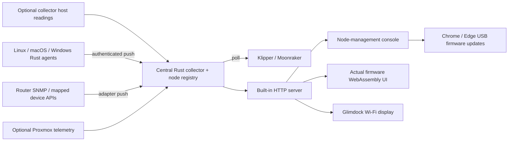

# One collector, one console, many devices

Glimdock receives native agent pushes, collects optional local/polling sources and publishes a bounded device registry.
The desk display connects once to that collector. Adding or renaming a node in
the console changes the inventory the display receives; it does not require a
per-node firmware build or a separate display installation.

## Runtime boundaries

`glimdock-collector run` starts collection, a private configuration service and
the HTTP server together on Linux or macOS. These are coordinated tasks in one
Rust process. The HTML, browser renderer and firmware update bundle are embedded
in that executable and served on the same origin as `/api/v1/nodes`,
`/api/v1/snapshot`, `/api/v1/snapshots`, `/api/v1/config` and the bounded
`/api/v1/agents/enroll` / `/api/v1/agents/push` ingest endpoints.

The optional Linux systemd installation keeps the same executable in three
processes: privileged collectors/configuration and an unprivileged HTTP reader.
That deployment is useful for additional host probes. It is an operating choice,
not a dependency on Proxmox or on a separate web application.

The collector's own host is an optional `server` node. A paired agent is a native push input; a remote polling feed can represent a
compatible device exporter, Proxmox host or printer.
An OS/platform identifies the readings and labels available on a server node;
it does not imply a special display firmware. Proxmox supplies extra guest,
storage and GPU information. Klipper supplies a job and heater model.

Device agents normalize native OS readings, SNMP OIDs or selected API fields
into schema-1 snapshots. Windows runs the device agent; the central collector's
private configuration service requires Unix. Agent enrollment is explicit through a one-time key. The collector assigns a
stable node ID and binds the durable agent identity/platform. Name changes and
switching an existing device from polling to push retain its ID. Polling feeds
remain supported; no network-wide scanning or automatic credential discovery is
needed.

## Ownership and freshness

The collector owns node definitions, pairing-key hashes and per-agent publisher
credential hashes. Each agent owns its durable private identity and publisher
credential; SNMP/API source secrets remain on the adapter host. The display owns
its Wi-Fi, collector pairing and appearance preferences. The console can read
whether a source has a saved secret but cannot retrieve that secret.

Display and configuration bearer credentials have distinct roles. An integrated
hub also accepts a credential-free request from an actual loopback peer with a
localhost Host header; writes require its same Origin. A supplied bearer never
gains a broader role through the loopback shortcut. A LAN display uses its read
credential. The optional fixed-origin localhost bridge keeps credentials on
the computer attached to USB and forwards only the bounded collector APIs.

Schema 2 holds the complete registry and its per-node snapshots. Selected
schema-1 responses retain the registry descriptors and summary metrics. Each
source has independent age/TTL rules, so a fresh HTTP response does not refresh
a stopped upstream measurement. Active display capacity is four nodes, while
up to sixteen configured remote nodes can remain paused and manageable.

## Agent enrollment and ingest

The console's authenticated `pair-agent` configuration action creates a node and
returns a random, single-use pairing key once. It expires after ten minutes.
Saved public configuration exposes only `registered`, `pairing_pending` and
`revoked` status, not pairing keys, publisher credentials or hashes. Re-pairing
revokes the prior publisher immediately and clears its current readings.

The agent creates a durable random identity and publisher credential before
calling `POST /api/v1/agents/enroll` with the pairing key. Enrollment binds the
assigned node, agent, platform and credential. The same pending agent material
can recover a lost enrollment response without allocating a second identity.
Future starts reuse the private state rather than the one-time key. Explicit
`--re-enroll` recovery requires a fresh key, retains the durable agent identity
and rotates its publisher credential. The existing grant targets the same
central node ID. Recovery flags are omitted from the permanent service command
after successful enrollment.

`POST /api/v1/agents/push` accepts only this scoped publisher and bounded schema-1
snapshots. It checks node/agent identity, session, advancing sequence and source
measurement time. Neither display nor management keys authorize ingest; an agent
credential cannot read collector telemetry or edit nodes. The server rejects
replays, expired readings, cross-node publishing and unauthorized requests.

Accepted readings are atomically published to a private inbox consumed by the
central runtime. This works with the combined process and the existing split
Linux deployment. Pausing retains enrollment but removes the active node;
revoking or deleting removes authorization and current readings. Existing
collector/display keys and registered IDs survive upgrades.

Receipt time (`last_seen`) is distinct from source measurement time (`sample_at`
on live descriptors, `sampled_at` inside agent metadata). Each node has its own
TTL. Repeated HTTP success does not renew a stale sample; silent, revoked or
expired devices publish unknown numeric readings. Cadence changes are returned
in ingest acknowledgments and update agent collection.

Agents keep one latest in-memory sample, use bounded jittered retry backoff and
drop samples older than their TTL. There is no unbounded queue or disk telemetry
backlog. A private state directory holds identity, credentials and the process
lock; it does not hold accumulated measurements. Normal shutdown stops without
flushing stale readings. Native agents open no incoming listener in push mode;
the former read-only listener is available explicitly for compatible polling.

## Firmware and browser updates

The browser compiles production UI, fonts, LVGL rendering, snapshot parsing and
touch handling to WebAssembly. Browser transport adapters supply feed/config
requests. Physical LCD, touch and Wi-Fi drivers remain ESP32 implementations.
The public website demo uses this same renderer with authored example readings.

The public update bundle contains no private pairing defaults. Its manifest
binds four ESP32-S3 images to their sizes and hashes. Chrome/Edge Web Serial
requires HTTPS or localhost, checks the supported board and power latch, writes
only ranges outside device NVS, and verifies the images before resetting.
Paired devices retain settings. An unpaired public image opens setup.

## Repository map

| Path | Responsibility |
| --- | --- |
| `Cargo.toml`, `Cargo.lock` | Shared Rust workspace and dependency graph |
| `collector-rs/` | Central collection, registry, configuration and built-in server |
| `device-agent-rs/` | Native OS, SNMP and mapped API agents |
| `collector-web/` | Embedded console, production emulator and public update assets |
| `firmware/` | ESP32 drivers and shared Glimdock UI |
| `examples/` | Generic configuration, agent adapters and synthetic snapshots |
| `deploy/` | Current Rust Linux installation and compatible service names |
| `integrations/truenas/` | Optional read-only NAS-side compatibility probe |
| `tools/` | Build, licensing, packaging and firmware verification tools |
| `enclosure/pebble-landscape/` | Current Pebble r19 concept and prototype CAD |
| `commercial/site/` | Product website, exact demo and existing commerce server |
| `legacy/python/` | Earlier engine/design preview, retained as reference |

Older CAD concepts, validation logs and `release/glimdock-v0.1.0` remain
historical artifacts. Current guides are the root README/SETUP and `public-docs/`.
