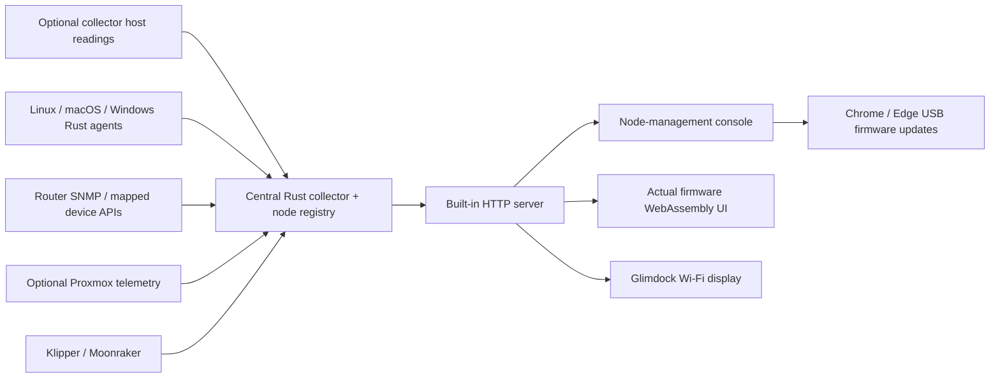

# One collector, one console, many devices

Glimdock collects readings centrally and publishes a bounded device registry.
The desk display connects once to that collector. Adding or renaming a node in
the console changes the inventory the display receives; it does not require a
per-node firmware build or a separate display installation.

## Runtime boundaries

`glimdock-collector run` starts collection, a private configuration service and
the HTTP server together on Linux or macOS. These are coordinated tasks in one
Rust process. The HTML, browser renderer and firmware update bundle are embedded
in that executable and served on the same origin as `/api/v1/nodes`,
`/api/v1/snapshot`, `/api/v1/snapshots` and `/api/v1/config`.

The optional Linux systemd installation keeps the same executable in three
processes: privileged collectors/configuration and an unprivileged HTTP reader.
That deployment is useful for additional host probes. It is an operating choice,
not a dependency on Proxmox or on a separate web application.

The collector's own host is an optional `server` node. A remote feed is an input
to the registry and can represent a server/device, a Proxmox host or a printer.
An OS/platform identifies the readings and labels available on a server node;
it does not imply a special display firmware. Proxmox supplies extra guest,
storage and GPU information. Klipper supplies a job and heater model.

Device agents normalize native OS readings, SNMP OIDs or selected API fields
into schema-1 snapshots. Windows runs the device agent; the central collector's
private configuration service requires Unix. Feed registration is explicit;
stable IDs are assigned when omitted and preserved when names change. There is
no network-wide automatic discovery.

## Ownership and freshness

The collector owns node definitions and source credentials. The display owns
its Wi-Fi, collector pairing and appearance preferences. The console can read
whether a source has a saved secret but cannot retrieve that secret.

Display and configuration bearer credentials have distinct roles. An integrated
hub also accepts a credential-free request from an actual loopback peer with a
localhost Host header; writes require its same Origin. A supplied bearer never
gains a broader role through the loopback shortcut. A LAN display uses its read
credential. The optional fixed-origin localhost bridge keeps credentials on
the computer attached to USB and forwards only the bounded collector APIs.

Schema 2 holds the complete registry and its per-node snapshots. Selected
schema-1 responses retain the registry descriptors and summary metrics. Each
source has independent age/TTL rules, so a fresh HTTP response does not refresh
a stopped upstream measurement. Active display capacity is four nodes, while
up to sixteen configured feeds can remain paused and manageable.

## Firmware and browser updates

The browser compiles production UI, fonts, LVGL rendering, snapshot parsing and
touch handling to WebAssembly. Browser transport adapters supply feed/config
requests. Physical LCD, touch and Wi-Fi drivers remain ESP32 implementations.
The public website demo uses this same renderer with authored example readings.

The public update bundle contains no private pairing defaults. Its manifest
binds four ESP32-S3 images to their sizes and hashes. Chrome/Edge Web Serial
requires HTTPS or localhost, checks the supported board and power latch, writes
only ranges outside device NVS, and verifies the images before resetting.
Paired devices retain settings. An unpaired public image opens setup.

## Repository map

| Path | Responsibility |
| --- | --- |
| `Cargo.toml`, `Cargo.lock` | Shared Rust workspace and dependency graph |
| `collector-rs/` | Central collection, registry, configuration and built-in server |
| `device-agent-rs/` | Native OS, SNMP and mapped API agents |
| `collector-web/` | Embedded console, production emulator and public update assets |
| `firmware/` | ESP32 drivers and shared Glimdock UI |
| `examples/` | Generic configuration, agent adapters and synthetic snapshots |
| `deploy/` | Current Rust Linux installation and compatible service names |
| `integrations/truenas/` | Optional read-only NAS-side compatibility probe |
| `tools/` | Build, licensing, packaging and firmware verification tools |
| `enclosure/pebble-landscape/` | Current Pebble r19 concept and prototype CAD |
| `commercial/site/` | Product website, exact demo and existing commerce server |
| `legacy/python/` | Earlier engine/design preview, retained as reference |

Older CAD concepts, validation logs and `release/glimdock-v0.1.0` remain
historical artifacts. Current guides are the root README/SETUP and `public-docs/`.
